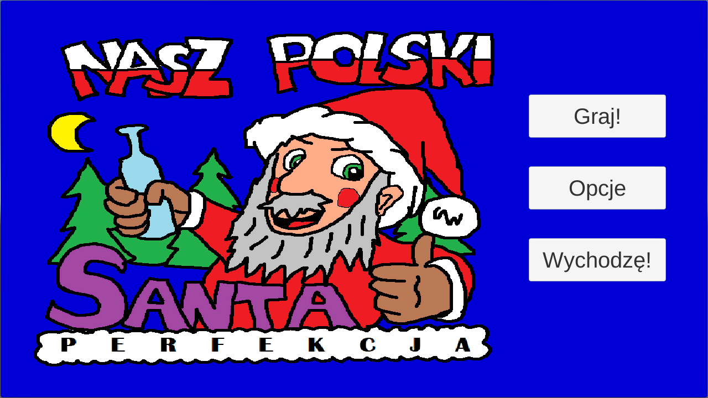
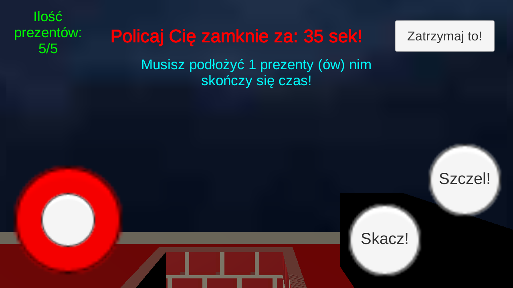
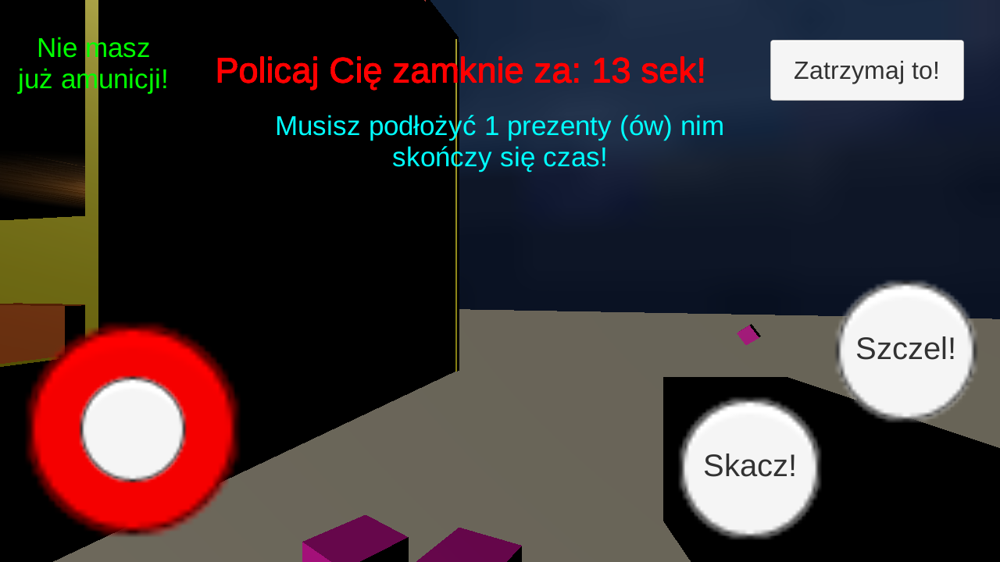
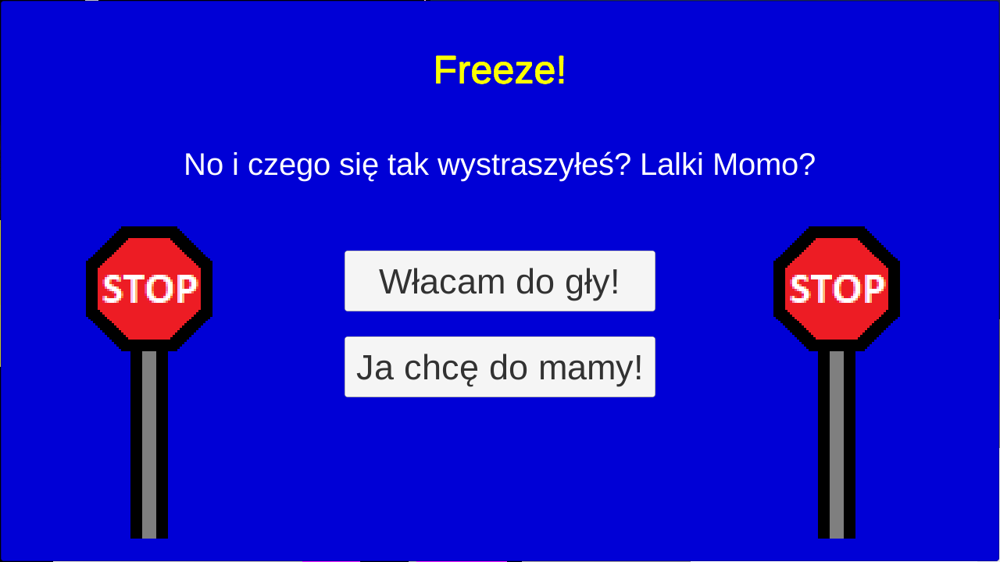

# Nasz Polski Santa: Perfekcja

## What's new?

There is no new features.

## About project

Funny 3D Xmas game made on Android devices using Unity3D Engine. For educational purposes and just to have fun with developing games.

Screenshots below:

## Technologies used in the project

* Unity3D

## Goals

Main goal is to learn more techniques of making games in Unity3D environment.

## License

My project is under BSD-2-Clause license. You can use some parts from my code but remember to credit me as an appreciation to my work! Thanks! Awoo!

© 2022 Paweł "Wilczeq/Vlk" Turoń
